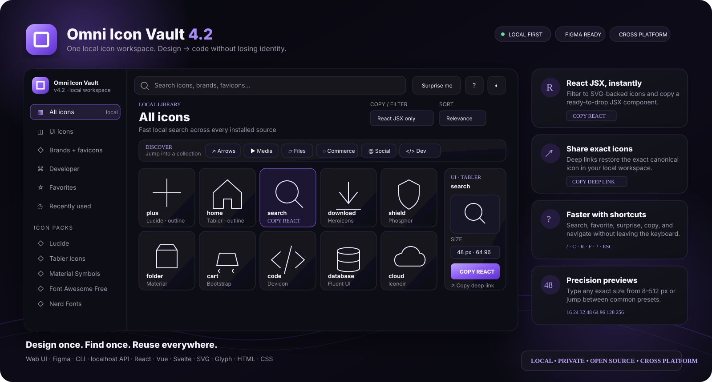
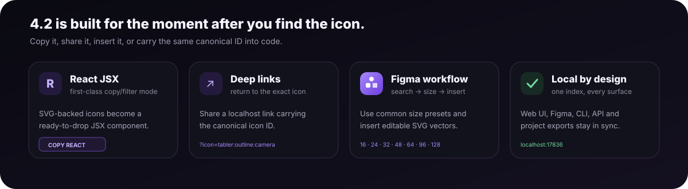
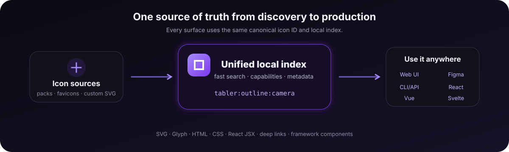
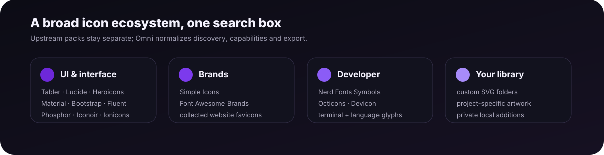

<div align="center">
  

# Omni Icon Vault

### One beautiful local icon workspace for Figma, websites, apps, terminals, and design systems.

Search tens of thousands of icons from many open-source ecosystems, collect favicons, add your own SVGs, then reuse the **same canonical icon ID** across design and code.

<p>
  <a href="https://github.com/PredragCkautovic/omni-icon-vault/releases/latest"></a>
  <a href="https://github.com/PredragCkautovic/omni-icon-vault/actions/workflows/ci.yml"></a>
  <a href="LICENSE"></a>
</p>

<p>
  
  
  
  
  
  
</p>

**[Download](https://github.com/PredragCkautovic/omni-icon-vault/releases/latest)** · **[Web UI](docs/WEB_UI.md)** · **[Figma](docs/FIGMA.md)** · **[CLI](docs/CLI.md)** · **[Architecture](docs/ARCHITECTURE.md)** · **[Contributing](CONTRIBUTING.md)**
</div>

<p align="center">
  
</p>

> [!NOTE]
> Omni is local-first. After the initial icon-source download, browsing, filtering, copying, Figma lookup, CLI search, and project exports run against your local index.


> [!TIP]
> **New in 4.2:** React JSX copy/filter, icon deep links, Discover shortcuts, keyboard command guide, 8–512 px exact previews with presets, and a more polished Figma workflow.

## 4.2 Flagship release

| New capability | What it changes |
|---|---|
| **React JSX copy/filter** | narrow the grid to SVG-backed icons and copy a ready component |
| **Icon deep links** | reopen the exact canonical icon later with a shareable localhost URL |
| **Discover shortcuts** | jump straight into arrows, media, files, commerce, social, developer or map searches |
| **Precision previews** | type any size from 8–512 px or use common presets |
| **Keyboard guide** | press `?` for shortcuts; `R` surprises, `F` favorites |
| **Figma presets** | choose common insert sizes without retyping values |

## Why Omni?

Icon workflows tend to fragment: one pack in Figma, another package in frontend code, developer glyphs in a Nerd Font, random SVGs in folders, and favicons copied by hand. Omni turns that into one searchable workspace.

| You need to… | Omni gives you… |
|---|---|
| find icons quickly | one fast local search across installed packs |
| use the same icon in Figma and code | stable canonical IDs such as `tabler:outline:camera` |
| work with different formats | SVG, glyph, HTML, CSS, JSON and framework exports |
| keep brand/favicons nearby | brand packs plus a local favicon collector |
| include project-specific artwork | a searchable `custom-icons/` library |
| stay offline/private after setup | localhost API + local index, no analytics layer |

## Highlights

- **Fast API-driven Web UI** with pagination instead of loading the whole database into the page.
- **True copy-capability filters** — SVG shows SVG-capable icons, Glyph shows real glyph-capable icons, and the same applies to HTML/CSS.
- **Figma development plugin** powered by the same local API.
- **Favorites and recent history** for quick reuse.
- **Exact preview sizing** from 8–512 px with synchronized slider, numeric input, and presets.
- **Custom SVGs and favicons** indexed beside upstream packs.
- **Cross-platform installers** for Windows, macOS and Linux.
- **Design-to-code exports** for React, Vue, Svelte, SVG, HTML, CSS and JSON — plus one-click React JSX copy in the Web UI.
- **Canonical IDs** that survive across browser, CLI, API, Figma and project manifests.

<p align="center">
  
</p>

## One source of truth

<p align="center">
  
</p>

The browser, Figma plugin, CLI and API all speak the same language:

```text
tabler:outline:camera
simpleicons:brand:github
material:outlined:settings
favicon:example.com
```

That means the icon you chose during design can be the exact icon your app exports later.

## Icon ecosystem

<p align="center">
  
</p>

Omni indexes a broad mix of UI, brand and developer sources, including Font Awesome Free, Bootstrap Icons, Material Symbols, Tabler, Lucide, Heroicons, Phosphor, Iconoir, Ionicons, Fluent UI System Icons, Simple Icons, Nerd Fonts Symbols, Octicons and Devicon.

Third-party archives are **not vendored into this repository**. The installer downloads pinned sources locally and builds the index on the user's machine. See [THIRD_PARTY_NOTICES.md](THIRD_PARTY_NOTICES.md) for licensing notes.

> [!IMPORTANT]
> Brand marks and favicons can be subject to trademark or brand-usage rules independently of the icon library license.

## Quick start

### Requirements

- Python **3.10+**
- Internet access for the first source download
- Figma Desktop only if you want the local development plugin

### Windows

Download the Windows release, extract it, then run:

```text
RUN_ME_FIRST.cmd
```

or:

```text
INSTALL_WINDOWS.cmd
```

Open a new terminal and verify:

```powershell
omni-icons doctor
omni-icons open
```

### macOS

```bash
chmod +x INSTALL_MAC.command
./INSTALL_MAC.command
omni-icons doctor
omni-icons open
```

### Linux

```bash
chmod +x INSTALL_LINUX.sh
./INSTALL_LINUX.sh
omni-icons doctor
omni-icons open
```

The Web UI opens at:

```text
http://localhost:17836
```

## Web UI

The local workspace supports:

- pack/category navigation
- search aliases
- Favorites + Recently Used
- SVG / glyph / raster representation filters
- SVG / Glyph / HTML / CSS **copy-capability filters**
- relevance / name / pack sorting
- compact / comfortable / large grid density
- dark / light / system theme
- icon detail drawer
- foreground/background preview controls
- slider + exact pixel size input
- direct copy and download actions
- React JSX copy/filter for SVG-backed icons
- shareable deep links for exact icon details
- Discover shortcuts and an in-app keyboard guide

Useful shortcuts:

| Key | Action |
|---|---|
| `/` or `Ctrl/Cmd + K` | focus search |
| `Enter` | open the first/focused result |
| `C` | copy with the active copy mode |
| `R` | open a random matching icon |
| `F` | toggle favorite for the open icon |
| `?` | open the keyboard guide |
| `Esc` | close details or dialogs |

See [docs/WEB_UI.md](docs/WEB_UI.md) for the full guide.

## Figma

1. Install Omni normally.
2. Start the local service with `omni-icons start`.
3. In Figma Desktop, import `figma-plugin/manifest.json` as a development plugin.
4. Run **Omni Icon Vault Local** from Plugins → Development.
5. Search and insert icons directly into the canvas.

SVG-backed icons are inserted as editable vectors. Font-backed packs use their installed local fonts.

Full setup: [docs/FIGMA.md](docs/FIGMA.md).

## CLI

```bash
omni-icons search camera
omni-icons search github --source kind:brand
omni-icons search python --source kind:developer
omni-icons show tabler:outline:camera
omni-icons copy tabler:outline:camera --format svg
```

Favicons:

```bash
omni-icons favicon add github.com
omni-icons favicon list
omni-icons favicon refresh
```

Projects:

```bash
omni-icons init .
omni-icons sync
```

See [docs/CLI.md](docs/CLI.md).

## Custom SVGs

Drop SVG files under:

```text
custom-icons/
```

Organize them however you like:

```text
custom-icons/
├── automotive/
│   ├── engine.svg
│   └── brake-disc.svg
└── company/
    └── logo-mark.svg
```

Then rebuild:

```bash
omni-icons rebuild
```

Your custom assets become first-class search results with canonical IDs.

## Local API

Omni exposes a localhost-only API on port `17836`.

```text
GET /api/health
GET /api/stats
GET /api/search?q=camera
GET /api/search?capability=svg&q=camera
GET /api/icon?id=tabler:outline:camera
GET /api/sources
```

Example:

```bash
curl 'http://localhost:17836/api/search?q=camera&capability=svg&limit=10'
```

The Web UI and Figma plugin use this same API.

## Repository layout

```text
browser/          local Web UI
figma-plugin/     local Figma development plugin
tools/            indexer, server, CLI and platform helpers
scripts/          release/build tooling
docs/             user + contributor documentation
examples/         example project configuration
custom-icons/     user-owned SVG library
licenses/         notices for downloaded upstream assets
tests/            cross-platform test suite
```

Runtime downloads such as `vendor/`, caches and collected favicons are intentionally excluded from source releases.

## Development

```bash
git clone https://github.com/PredragCkautovic/omni-icon-vault.git
cd omni-icon-vault
python -m unittest discover -s tests -v
python -m compileall -q install.py uninstall.py omni.py tools scripts tests
```

Run directly from a checkout:

```bash
python omni.py doctor
python omni.py open
```

Read [CONTRIBUTING.md](CONTRIBUTING.md) and [docs/ARCHITECTURE.md](docs/ARCHITECTURE.md) before making structural changes.

## Releases

Releases are tag-driven and CI runs on Linux, macOS and Windows.

```bash
VERSION="$(cat VERSION)"
git tag -a "v$VERSION" -m "Omni Icon Vault $VERSION"
git push origin "v$VERSION"
```

The release workflow builds platform archives plus source and checksums. See [docs/RELEASING.md](docs/RELEASING.md).

## Security & privacy

- Local API binds to localhost.
- Browser assets and index data are served locally.
- Custom SVGs are sanitized before indexing.
- Website favicon fetching is explicit and user-triggered.
- No tracking/analytics layer is part of Omni.

Please report security issues through [SECURITY.md](SECURITY.md).

## License

Omni Icon Vault's own code is released under the **MIT License**.

Downloaded icon packs keep their upstream licenses, and brand marks may have separate trademark requirements. Read [THIRD_PARTY_NOTICES.md](THIRD_PARTY_NOTICES.md) before redistributing third-party assets.

---

<div align="center">

### Find once. Use everywhere.

**[Download latest](https://github.com/PredragCkautovic/omni-icon-vault/releases/latest)** · **[Report a bug](https://github.com/PredragCkautovic/omni-icon-vault/issues)** · **[Contribute](CONTRIBUTING.md)**

</div>
