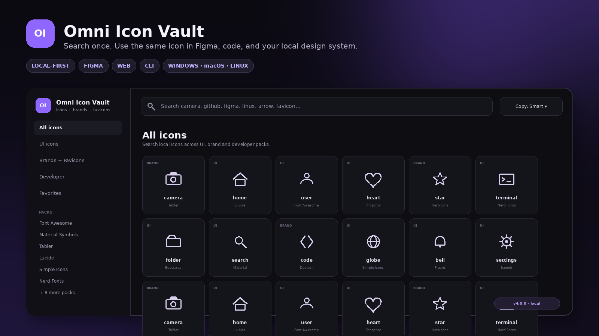
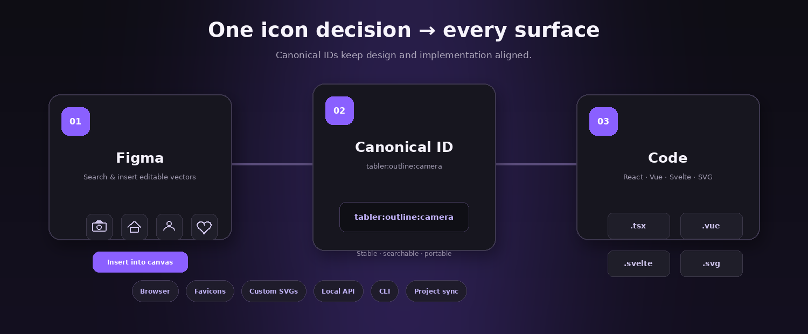
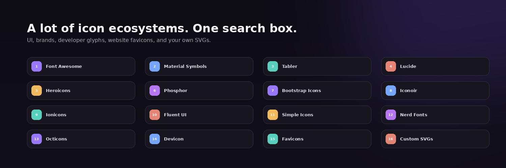
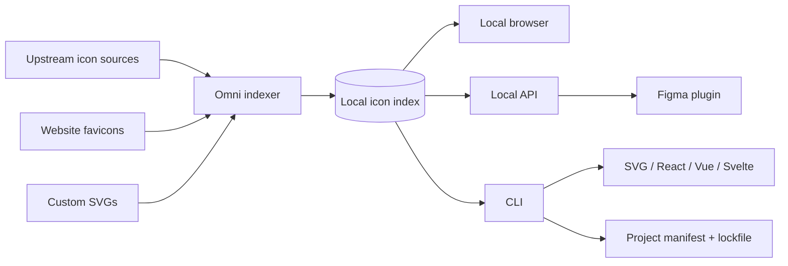

<div align="center">

# ◈ Omni Icon Vault

### One local icon library for Figma, websites, apps, terminals, and design systems.

Search across UI icons, brand marks, developer glyphs, favicons, and your own SVGs — then use the **same canonical icon ID** from design to production code.

<p>
  <a href="https://github.com/PredragCkautovic/omni-icon-vault/releases/latest"></a>
  <a href="https://github.com/PredragCkautovic/omni-icon-vault/actions/workflows/ci.yml"></a>
  <a href="LICENSE"></a>
  <a href="https://github.com/PredragCkautovic/omni-icon-vault/stargazers"></a>
</p>

<p>
  
  
  
  
  
  
</p>

**[Download latest release](https://github.com/PredragCkautovic/omni-icon-vault/releases/latest)** · **[Figma setup](docs/FIGMA.md)** · **[CLI reference](docs/CLI.md)** · **[Architecture](docs/ARCHITECTURE.md)** · **[Contributing](CONTRIBUTING.md)**

</div>

<br>

<p align="center">
  
</p>

<p align="center"><sub>Interface overview. Available packs and icon counts depend on the source versions installed on your machine.</sub></p>

---

## Why Omni Icon Vault?

Most projects end up with several disconnected icon workflows: one library in Figma, another npm package in the frontend, a Nerd Font in the terminal, random SVGs in a folder, and favicons copied from websites by hand.

**Omni turns those separate workflows into one local library.**

| Problem | Omni's approach |
|---|---|
| Find the same icon again when coding a Figma design | Every icon gets a stable **canonical ID** |
| Search several icon websites separately | Search all installed packs from **one local browser** |
| Manually download and clean SVGs | Copy/export SVG, HTML, CSS, React, Vue, or Svelte directly |
| Brand marks and website favicons live elsewhere | Brand packs and **real collected favicons** are indexed too |
| Custom company icons are disconnected | Drop your own SVGs into `custom-icons/` |
| Design and code drift apart | Figma, CLI, API, and project manifests share the same index |

### At a glance

- 🔎 **One search** for UI, brand, developer, favicon, and custom icons.
- 🎨 **Figma integration** that inserts SVG-backed icons as editable vectors.
- 🔗 **Canonical IDs** shared across the browser, Figma plugin, CLI, API, and generated files.
- ⚡ **Local-first** browsing and search after the initial source download.
- 🧩 **React / Vue / Svelte / SVG / HTML / CSS / JSON** export.
- 🌐 **Website favicon collector** with local indexing and SVG sanitization.
- 🗂️ **Custom SVG library** for project-specific or company-specific icon sets.
- 💻 **Windows, macOS, and Linux** installers with a common CLI.
- 🐍 **Python 3.10+**, with no Node.js requirement for Omni itself.

---

## Design → Figma → code

<p align="center">
  
</p>

An icon such as:

```text
tabler:outline:camera
```

can be selected in Omni, inserted into Figma, referenced in a project manifest, exported as a framework component, and retrieved through the local API — without changing identity along the way.

```text
Browser / Figma / CLI
          │
          ▼
 tabler:outline:camera
          │
    ┌─────┼─────────┐
    ▼     ▼         ▼
  React   Vue      Svelte
    │     │          │
    └─────┴──── SVG / HTML / CSS
```

---

## Icon ecosystem

<p align="center">
  
</p>

Omni currently knows how to index **14 upstream icon ecosystems**, plus collected website favicons and your own local SVGs.

| Category | Sources |
|---|---|
| **General UI** | Font Awesome Free, Bootstrap Icons, Material Symbols, Tabler, Lucide, Heroicons, Phosphor, Iconoir, Ionicons, Fluent UI System Icons |
| **Brands** | Simple Icons, Font Awesome Brands, Ionicons brand icons |
| **Developer** | Nerd Fonts Symbols, Octicons, Devicon |
| **Personal / local** | Website favicons, `custom-icons/` |

Third-party icon archives are **not committed into this repository**. Omni downloads pinned upstream sources to the user's machine during installation and builds a unified local index from them.

See [THIRD_PARTY_NOTICES.md](THIRD_PARTY_NOTICES.md) for licensing notes.

> [!IMPORTANT]
> Open-source icon files and brand logos are not the same thing legally. Brand marks, company logos, and collected favicons can still be subject to trademark and brand-usage rules even when the underlying icon collection is openly licensed.

---

# Quick start

## Requirements

- **Python 3.10 or newer**
- Internet access during the initial icon-source download
- Internet access when adding or refreshing website favicons
- **Figma Desktop** only if you want to use the local Figma development plugin

Download the correct ZIP from the **[latest release](https://github.com/PredragCkautovic/omni-icon-vault/releases/latest)**, extract it, and run the installer for your platform.

### Windows

Double-click:

```text
RUN_ME_FIRST.cmd
```

or run:

```text
INSTALL_WINDOWS.cmd
```

Then open a new terminal:

```powershell
omni-icons doctor
omni-icons open
```

### macOS

Run:

```bash
./INSTALL_MAC.command
```

Then:

```bash
omni-icons doctor
omni-icons open
```

If macOS blocks the downloaded script, allow it in **System Settings → Privacy & Security**, or execute it directly from Terminal.

### Linux

Run:

```bash
chmod +x INSTALL_LINUX.sh
./INSTALL_LINUX.sh
```

Then:

```bash
omni-icons doctor
omni-icons open
```

The Linux installer uses user-level desktop integration where possible. `systemd --user` is used when available, but the core application does not depend on systemd.

---

# Using Omni

## 1. Browse and search locally

Open the local browser:

```bash
omni-icons open
```

Search naturally:

```text
camera
arrow left
github
python
terminal
folder
figma
favicon
```

Filter by broad category or a specific source pack, favorite frequently used icons, and choose what the Copy action should return.

Useful keyboard shortcuts:

| Key | Action |
|---|---|
| `/` | Focus search |
| `Esc` | Close icon details |

---

## 2. Search from the terminal

```bash
omni-icons search camera
omni-icons search github --source kind:brand
omni-icons search python --source kind:developer
omni-icons search folder --source tabler
```

Inspect one result:

```bash
omni-icons show tabler:outline:camera
```

Copy a representation:

```bash
omni-icons copy tabler:outline:camera --format svg
omni-icons copy fontawesome:solid:user --format html
omni-icons copy simpleicons:brand:github --format id
```

---

## 3. Use Omni in Figma

Start Omni and print the Figma plugin path:

```bash
omni-icons figma
```

Then in **Figma Desktop**:

1. Open **Plugins → Development → Import plugin from manifest…**
2. Select `figma-plugin/manifest.json` from the Omni installation.
3. Run **Omni Icon Vault Local** from Development plugins.
4. Search for an icon.
5. Click it to insert it into the canvas.

### What gets inserted?

| Icon type | Figma result |
|---|---|
| SVG-backed icon | Editable vector node |
| SVG favicon | Editable vector node |
| PNG / WebP favicon | Image-filled rectangle |
| Nerd Font / Material font glyph | Text using the locally installed icon font |

The plugin talks only to Omni's local server at:

```text
http://localhost:17836
```

Detailed setup and troubleshooting: **[docs/FIGMA.md](docs/FIGMA.md)**.

---

## 4. Export icons directly into a project

Export a single icon as React:

```bash
omni-icons export tabler:outline:camera \
  --format react \
  --out src/components/icons
```

Available export formats:

```text
asset  svg  html  css  json  react  vue  svelte
```

Examples:

```bash
# SVG
omni-icons export lucide:outline:search --format svg --out public/icons

# Vue
omni-icons export tabler:outline:camera --format vue --out src/components/icons

# Svelte
omni-icons export phosphor:regular:heart --format svelte --out src/lib/icons
```

---

## 5. Keep project icons reproducible

Initialize an Omni manifest inside a project:

```bash
cd my-project
omni-icons init .
```

Edit `omni-icons.json`:

```json
{
  "format": "react",
  "out": "src/components/icons",
  "icons": [
    { "id": "tabler:outline:camera", "as": "Camera" },
    { "id": "fontawesome:solid:user", "as": "User" },
    { "id": "simpleicons:brand:github", "as": "Github" }
  ]
}
```

Generate them:

```bash
omni-icons sync
```

Omni also writes `omni-icons.lock.json` with hashes so the generated assets can be checked and reproduced.

---

# Favicons

Turn a real website favicon into a searchable Omni entry:

```bash
omni-icons favicon add github.com
omni-icons favicon add figma.com
omni-icons favicon add https://example.com
```

Manage the local favicon collection:

```bash
omni-icons favicon list
omni-icons favicon refresh
omni-icons favicon remove github.com
```

Collected favicons receive canonical IDs such as:

```text
favicon:github.com
```

Once indexed, they are available from the **browser, CLI, Figma plugin, API, and export pipeline**.

---

# Bring your own SVGs

Use Omni as a home for your own icon system too.

Drop SVG files anywhere below:

```text
custom-icons/
```

For example:

```text
custom-icons/
├── automotive/
│   ├── engine.svg
│   └── brake-disc.svg
├── business/
│   └── invoice.svg
└── my-brand/
    └── logo-mark.svg
```

Then rebuild the index:

```bash
omni-icons rebuild
```

The icons become searchable with stable IDs based on their path.

---

# Local API

The browser and Figma plugin use the same HTTP API:

```text
http://localhost:17836
```

Useful endpoints:

```text
GET /api/health
GET /api/search?q=camera
GET /api/search?q=github&source=kind:brand
GET /api/icon?id=tabler:outline:camera
GET /api/sources
```

Example:

```bash
curl "http://localhost:17836/api/search?q=camera"
```

This makes Omni usable from editor extensions, internal tools, scripts, generators, and future integrations without introducing a separate icon database.

---

# CLI cheat sheet

```bash
# General
omni-icons --version
omni-icons doctor
omni-icons open
omni-icons start
omni-icons stop
omni-icons status

# Search / inspect / export
omni-icons search camera
omni-icons show tabler:outline:camera
omni-icons copy tabler:outline:camera --format svg
omni-icons export tabler:outline:camera --format react --out src/icons

# Figma
omni-icons figma

# Favicons
omni-icons favicon add github.com
omni-icons favicon list
omni-icons favicon refresh

# Index / sources
omni-icons rebuild
omni-icons update

# Project pipeline
omni-icons init .
omni-icons sync
```

Full command documentation: **[docs/CLI.md](docs/CLI.md)**.

---

# Architecture



### Repository layout

```text
browser/          local icon browser
figma-plugin/     Figma development plugin
custom-icons/     local/custom SVG source folder
tools/            indexer, CLI, server, favicon manager
scripts/          release and publishing tooling
tests/            regression tests
docs/             user and contributor documentation
sources.json      pinned upstream source definitions
install.py        cross-platform installer
omni.py           top-level CLI entry point
```

For deeper implementation details see **[docs/ARCHITECTURE.md](docs/ARCHITECTURE.md)**.

---

# Privacy and security

Omni is intentionally local-first:

- The search index lives on your machine.
- The browser and Figma plugin talk to a localhost server.
- User-collected favicon assets and generated runtime data are excluded from Git by default.
- SVG favicon/custom-icon handling includes sanitization before rendering/import where applicable.
- No cloud account is required for the core Omni runtime.

Security issues should be reported using **[SECURITY.md](SECURITY.md)** rather than a public vulnerability issue.

---

# FAQ

<details>
<summary><strong>Does Omni work offline?</strong></summary>
<br>
Yes for normal local browsing/search after the icon sources have been downloaded and indexed. Internet access is still required for source updates and for collecting or refreshing website favicons.
</details>

<details>
<summary><strong>Does Omni bundle every third-party icon archive inside this GitHub repo?</strong></summary>
<br>
No. The repository contains Omni's code, adapters, browser, plugin, tests, and source definitions. Third-party packs are downloaded to the user's machine during installation. This keeps the repository smaller and makes upstream licensing/version boundaries clearer.
</details>

<details>
<summary><strong>Does it require Node.js?</strong></summary>
<br>
No. Omni's installer, local server, indexer, CLI, and release tooling are implemented around Python 3.10+ and the Python standard library. Your own web project may of course use Node/npm if you export React/Vue/Svelte components into it.
</details>

<details>
<summary><strong>Can I add private/company icons?</strong></summary>
<br>
Yes. Put your SVGs in <code>custom-icons/</code> and run <code>omni-icons rebuild</code>. They remain local unless you intentionally commit or distribute them yourself.
</details>

<details>
<summary><strong>Can I use brand icons commercially?</strong></summary>
<br>
Omni's own source code is MIT licensed, but every upstream icon set retains its own license. Company logos and favicons can also be protected by trademark rules. Check the upstream license and the relevant brand's usage guidelines for your intended use.
</details>

---

# Development

Clone the project:

```bash
git clone https://github.com/PredragCkautovic/omni-icon-vault.git
cd omni-icon-vault
```

Run the tests:

```bash
python -m unittest discover -s tests -v
```

Compile-check Python sources:

```bash
python -m compileall -q install.py uninstall.py omni.py tools scripts tests
```

Build release archives:

```bash
python scripts/build_release.py --dist dist
```

Read these before contributing:

- [CONTRIBUTING.md](CONTRIBUTING.md)
- [docs/ADDING_SOURCES.md](docs/ADDING_SOURCES.md)
- [CODE_OF_CONDUCT.md](CODE_OF_CONDUCT.md)

---

# Releases

Releases are tag-driven and the repository includes CI for Windows, macOS, and Linux.

```bash
git tag -a v4.0.0 -m "Omni Icon Vault 4.0.0"
git push origin v4.0.0
```

The release pipeline builds:

```text
Omni-Icon-Vault-4.0.0-source.zip
Omni-Icon-Vault-4.0.0-windows.zip
Omni-Icon-Vault-4.0.0-macos.zip
Omni-Icon-Vault-4.0.0-linux.zip
SHA256SUMS.txt
```

See **[docs/RELEASING.md](docs/RELEASING.md)** for the full publishing process.

---

# License

Omni Icon Vault's own source code is licensed under the **MIT License**. Third-party icon sets keep their original licenses and trademark restrictions.

- [LICENSE](LICENSE)
- [THIRD_PARTY_NOTICES.md](THIRD_PARTY_NOTICES.md)
- [licenses/NOTICE.txt](licenses/NOTICE.txt)

---

<div align="center">

### One search. One canonical ID. Design → Figma → code.

If Omni Icon Vault helps your workflow, **star the repository** so more designers and developers can find it.

[⭐ Star Omni Icon Vault](https://github.com/PredragCkautovic/omni-icon-vault) · [⬇ Download](https://github.com/PredragCkautovic/omni-icon-vault/releases/latest) · [🐛 Report a bug](https://github.com/PredragCkautovic/omni-icon-vault/issues)

</div>
